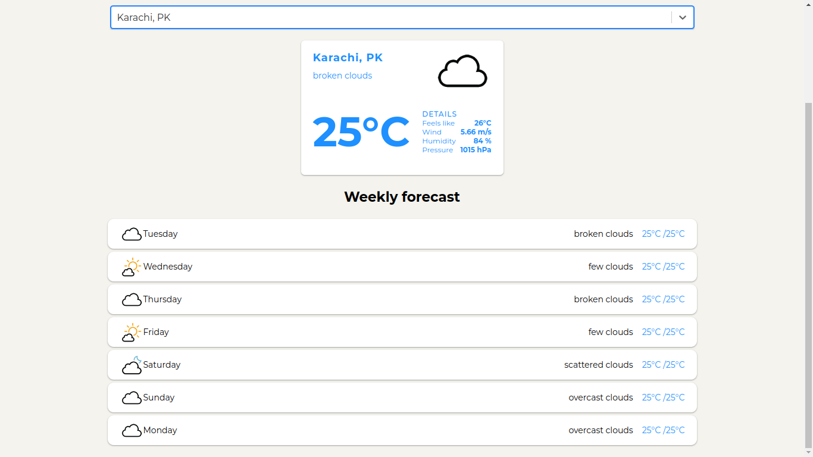
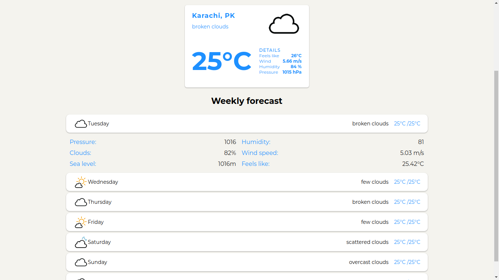

# Geo location based weather app

A geo location based weather app built with React and OpenWeatherMap and GeoCities API.

## Demo

You can check the demo <a href="https://daily-forecasts.netlify.app">here.</a>

## Installation

- Clone the repo
- Run `npm install`
- Provide the API key in the `API.js` file
- Run `npm start`
- Check the app on `localhost:3000`

## Technologies used

- React
- Rapid API
- OpenWeatherMap API
- Netlify

## Screenshots

